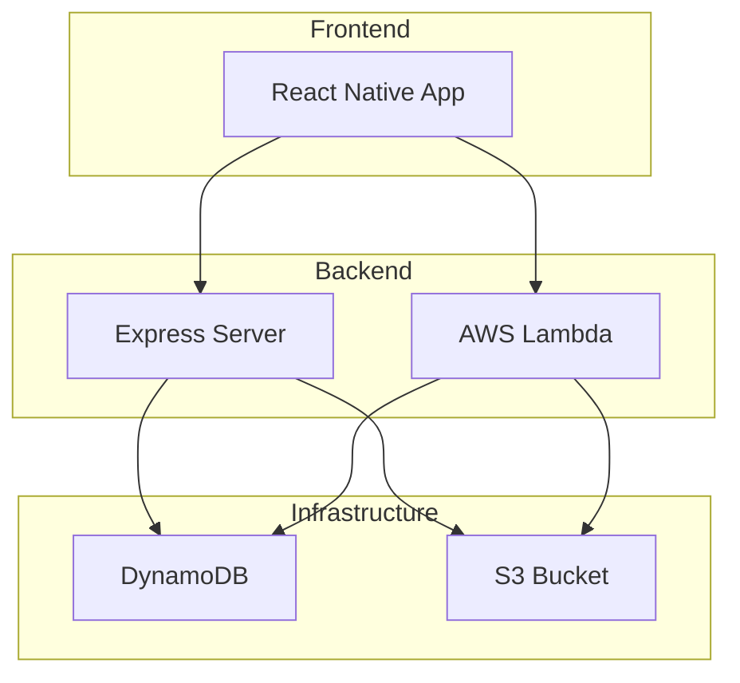
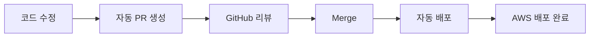

# 💕 Date Sense - AI 기반 소개팅 앱

> React Native + AWS 서버리스로 구축된 스마트한 소개팅 매칭 서비스

[](https://reactnative.dev/)
[](https://aws.amazon.com/)
[](LICENSE)

## 🎯 프로젝트 개요

**Date Sense**는 AI 기술을 활용한 스마트한 소개팅 매칭 서비스입니다.

### ✨ 주요 특징
- 🤖 **AI 기반 매칭** - 개인화된 추천 알고리즘
- 📱 **크로스 플랫폼** - iOS/Android 동시 지원
- ☁️ **서버리스 아키텍처** - AWS Lambda + DynamoDB
- 🔐 **보안 인증** - bcrypt 해시화 + JWT 토큰
- 📊 **실시간 통계** - 매칭 성공률 분석

## 🚀 빠른 시작

### 전체 프로젝트 실행
```bash
# 1. 프론트엔드 실행
cd frontend
npm install
npx expo start

# 2. 백엔드 실행 (새 터미널)
cd backend
npm install
npm run dev
```

### 상세 가이드
- **[프론트엔드 가이드](frontend/README.md)** - React Native 앱 개발
- **[백엔드 가이드](backend/README.md)** - AWS 서버리스 API
- **[개발 가이드](docs/DEVELOPMENT.md)** - 통합 개발 문서

## 🏗️ 아키텍처



## 📱 주요 기능

| 기능 | 설명 | 상태 |
|------|------|------|
| 🔐 **인증** | 소셜 로그인, 프로필 설정 | ✅ 완료 |
| 📸 **프로필** | 사진 업로드, 기본정보 입력 | ✅ 완료 |
| 🤖 **AI 매칭** | 개인화된 추천 시스템 | 🔄 개발중 |
| 💬 **채팅** | 실시간 메시지 교환 | 🔄 개발중 |
| 📊 **인사이트** | 매칭 성공률 분석 | 📋 계획 |

## 📁 프로젝트 구조

```
date-sense/
├── 📱 frontend/           # React Native + Expo 앱
│   ├── src/
│   │   ├── components/    # 재사용 컴포넌트
│   │   ├── screens/       # 화면 컴포넌트
│   │   ├── services/      # API 서비스
│   │   └── utils/         # 유틸리티 함수
│   └── package.json
├── 🔧 backend/            # AWS Lambda + Express API
│   ├── services/          # 비즈니스 로직
│   ├── scripts/           # 유틸리티 스크립트
│   └── package.json
├── 📖 docs/               # 프로젝트 문서
│   ├── DEVELOPMENT.md     # 개발 가이드
│   ├── database-schema.md # 데이터베이스 스키마
│   └── flow.md           # 서비스 플로우
└── 📄 README.md           # 프로젝트 개요
```

## 🔄 개발 워크플로우



## 📋 개발 체크리스트

### ✅ 완료된 기능
- [x] 프론트엔드 기본 구조 설정
- [x] 백엔드 API 설계 및 구현
- [x] 데이터베이스 스키마 설계
- [x] 인증 시스템 구현 (bcrypt 해시화)
- [x] 이미지 업로드 기능 (S3 연동)
- [x] 프로필 관리 시스템
- [x] 개발 환경 설정 (Express + Lambda)

### 🔄 진행중인 기능
- [ ] AI 매칭 알고리즘 구현
- [ ] 실시간 채팅 기능
- [ ] 푸시 알림 설정
- [ ] 테스트 코드 작성

### 📋 계획된 기능
- [ ] CI/CD 파이프라인 구축
- [ ] 성능 최적화
- [ ] 모니터링 시스템
- [ ] 데이터 분석 대시보드

## 🤝 기여하기

1. **Fork** the repository
2. **Create** your feature branch (`git checkout -b feature/amazing-feature`)
3. **Commit** your changes (`git commit -m 'Add some amazing feature'`)
4. **Push** to the branch (`git push origin feature/amazing-feature`)
5. **Open** a Pull Request

## 📞 지원

| 영역 | 문서 | 담당자 |
|------|------|--------|
| **프론트엔드** | [frontend/README.md](frontend/README.md) | React Native |
| **백엔드** | [backend/README.md](backend/README.md) | AWS Serverless |
| **전체 개발** | [docs/DEVELOPMENT.md](docs/DEVELOPMENT.md) | 통합 가이드 |
| **데이터베이스** | [docs/database-schema.md](docs/database-schema.md) | DynamoDB 스키마 |

## 📄 라이선스

이 프로젝트는 [MIT 라이선스](LICENSE) 하에 배포됩니다.

---

**Made with ❤️ by Date Sense Team** 